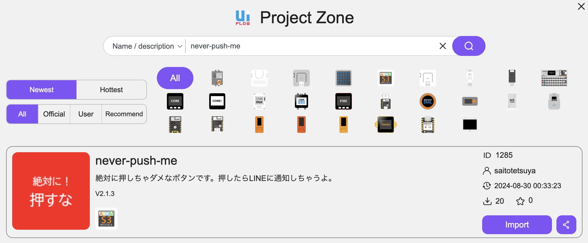
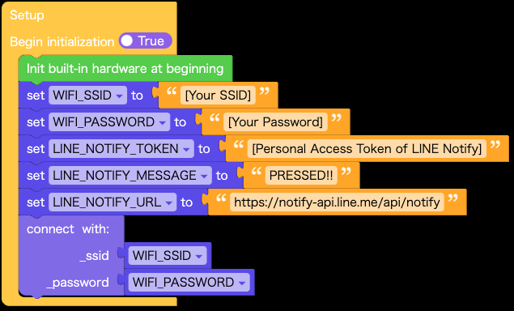

# 絶対に！押すなボタン


絶対に押しちゃダメなボタンです。押すなよ，絶対に押すなよ。

※元ネタは「[『絶対に！押すな』のボタン、押し放題の誘惑](https://www.nikkei.com/article/DGXZQOUC26A8A0W2A420C2000000/)」（2022 年 6 月 5 日 日経 MJ）です。

## はじめに

絶対に！押すなボタンは絶対に押しちゃダメなボタンで，[M5Stack 社](https://m5stack.com/) の [ATOMS3](https://shop.m5stack.com/products/atoms3-dev-kit-w-0-85-inch-screen)を使用して実装しています。

Arduino 版は ATOMS3 が USB キーボードとして認識され，絶対に押しちゃダメですが，ボタンが押されると指定されたキーコード（デフォルトでは `CTRL+ALT+DELETE`）を送信します。WiFi に接続してキーコードの送信と同時に LINE Notify で押されたことを通知することもできます。

UIFlow2 版は ATOMS3 を WiFi に接続し，絶対に押しちゃダメですが，ボタンが押されると LINE Notify で押されたことを通知します。

|            | キーコードの送信 | LINE Notify での通知 |
| :--------: | :--------------: | :------------------: |
| Arduino 版 |        ○         |          ○           |
| UIFlow2 版 |        ×         |          ○           |

LINE Notify で通知する場合は，LINE Notify の[マイページ](https://notify-bot.line.me/my/)でパーソナル・アクセス・トークンを発行する必要があります。

Arduino 版，UIFlow2 版とも Windows 11 と macOS Sonoma で動作確認をしています。

## Arduino 版

[M5Unified](https://github.com/m5stack/M5Unified)を使って実装しています。[VSCode](https://azure.microsoft.com/ja-jp/products/visual-studio-code) の [PlatformIO IDE](https://platformio.org/platformio-ide) 環境でコンパイルして実機にアップロードしてください。

デフォルトの`env:never-push-me`を選択してコンパイルすると，ボタンを押したときに決められたキーコードを送信します。

`env:never-push-me-with-line-notify`を選択してコンパイルすると，ボタンを押したときにキーコードを送信するだけでなく，WiFi に接続して LINE Notify にボタンが押されたことを通知します。

`env:never-push-me-with-line-notify`でコンパイルする場合は，`data` ディレクトリ（`platformio.ini`の`[platformio]`セクションにある`data_dir`で指定したディレクトリ）に以下 JSON ファイル（`line_notify.json`）を置いて LINE Notify に接続するために必要な情報を記載します。

```line_notify.json
{
    "ssid": "[SSID]",
    "password": "[パスワード]",
    "token": "[LINE Notify のパーソナル・アクセス・トークン]",
    "message": "[ボタンが押されたときに通知するメッセージ]"
}
```

`line_notify.json`を実機の SPIFFS に転送して設定を反映するためには，PlatformIO メニューから「Upload Filesystem Image」を選択するか，コマンドラインから`pio run --target uploadfs`を実行します。

### 実行方法

ATOMS3 を PC に接続すると，USB キーボードとして認識されます。絶対に押しちゃダメですが，押すと`CTRL+ALT+DELETE`が押されたのと同じ動作になります。
LINE Notify の通知を有効にしている場合は，ボタンを押すと指定したメッセージで LINE Notify に通知されます。

## UIFlow2 版

※[UIFlow2](https://uiflow2.m5stack.com/) の v2.1.3 以降で動作します。

Arduino 版とは異なり，キーコードを送信する機能はなく，ボタンが押されたときに LINE Notify で指定したメッセージを通知します。
UIFlow2 の「Import project from local file」メニューからプロジェクトファイル`uiflow2/never-push-me.m5f2`を読み込んでください。

また，同じものを Project Zone でも公開しています。検索窓に「never-push-me」と入力して検索し，Import ボタンを押すことで読み込むことができます。



### WiFi と LINE Notify の設定

プロジェクトを読み込んだら，WiFi と LINE Notify の設定をします。



1. 接続する WiFi の SSID とパスワードをそれぞれ変数`WIFI_SSID`と`WIFI_PASSWORD`に設定します。
2. ボタンが押されたときに通知する LINE Notify のパーソナルトークンを変数`LINE_NOTIFY_TOKEN`に設定します。
3. ボタンが押されたときに通知するメッセージを変数`LINE_NOTIFY_MESSAGE`に設定します。

### 実機へのアップロード

右下にある「Download the program to device」ボタンを押してください。


### 実行方法

ATOMS3 を起動すると，変数`WIFI_SSID`と変数`WIFI_PASSWORD`に設定した情報を使って WiFi に接続します。そして，絶対に押しちゃダメですが，ボタンを押すと LINE Notify で変数`LINE_NOTIFY_MESSEGE`に指定したメッセージを通知します。
